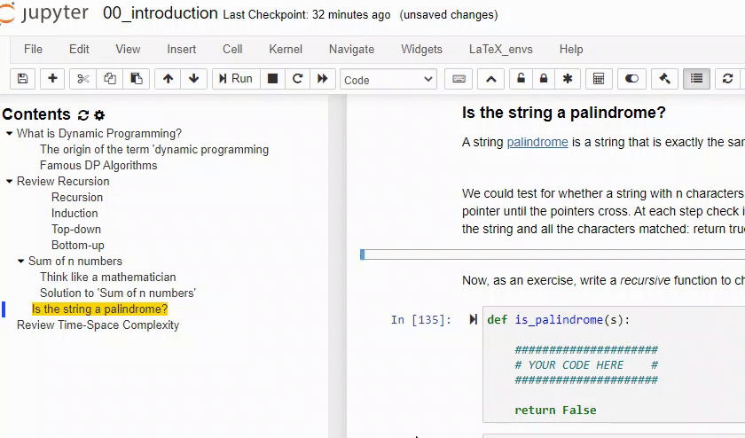

<h1 align="center">
    Magic of Dynamic Programming
   <!--img src="imgur.link.png" alt="Magic of Dynamic Programming" title="Magic of Dynamic Programming" /-->
</h1>

  

</a>

<a href="https://www.freecodecamp.org/news/how-open-source-licenses-work-and-how-to-add-them-to-your-projects-34310c3cf94/">
LICENSE TODO

  Does dynamic progrmming seem like dark magic to you? 
  Do you wish there was a step-by-step approach to any dynamic programming problem thrown at you? 
  Join me in this virtual classroom where I will teach you a method to design your own beautiful algorithms. 
   
  <strong>Author:</strong> <a href="https://www.linkedin.com/in/rachelyeshurun//">Rachel Yeshurun</a>

## Table of Contents

* **Course Overview**
  * [Introduction](#introduction)
    * [Who should take this course?](#audience)
    * [How to use this repository?](#usage)
  * [Behind the Scenes](#behind)
    * Video - [The Making of 'Magic](https://youtu.be/bh4HpT7Da2s)
    * [Credit](#credit)
        * [Lesson Plans & Pedagogy](#pedagogy)
        * [Other great notebooks](#inspiration)

* **Lesson 0: Review**
  * Video - [Recursion: sum of n numbers](https://youtu.be/roqumrTB9g0)
  * Notebook - [Lesson 0](https://mybinder.org/v2/gh/rachelyeshurun/magic-of-dynamic-programming/master?filepath=notebooks%2F00_introduction.ipynb)
  
* **Lesson 1: Memoization**
  * Notebook - [Lesson 1](https://mybinder.org/v2/gh/rachelyeshurun/magic-of-dynamic-programming/master?filepath=notebooks%2F01_memoization.ipynb)
  
* **Lesson 2: Fibonacci Numbers**
  * Video - [Find the n'th Fibonacci number]
  * Notebook - [Lesson 2](https://mybinder.org/v2/gh/rachelyeshurun/magic-of-dynamic-programming/master?filepath=notebooks%2F02_fibonacci.ipynb)

* **Lesson 3: The Drinking Game**
  * Video - [The Drinking Game: Introducing the 4 steps]
  * Notebook - [Lesson 3](https://mybinder.org/v2/gh/rachelyeshurun/magic-of-dynamic-programming/master?filepath=notebooks%2F03_drinking_game.ipynb)

* **Lesson 5: Paths in a Grid**
  * Video - [Paths in a Grid: More practice in the 4 steps]
  * Notebook - [Lesson 5]
  
* **Lesson 6: Happiness & Pinecones**
  * Video - [Happiness & Pinecones: Longest common sub-string]
  * Notebook - [Lesson 6]
  
* **Lesson 7: Flower Picking**
  * Video - [Flower Picking: Longest increasing sub-sequence]
  * Notebook - [Lesson 7]
  
* **Lesson 8: Knapsack**
  * Video - [Knapsack: Problems in pseudo-polynomial time]
  * Notebook - [Lesson 8]

* **Lesson 9: They're all DAGs**
  * Video - []
  * Notebook - [Lesson 9]
  
<h2 id="introduction">Introduction</h2>

Dynamic programming has the reputation for being tricky to master. 

- [ ] TODO

<h3 id="audience">Who is this repository for?</h3>

- [ ] TODO

<h3 id="usage">How to use this repository?</h2>

This course is designed to be taken over a few hours, for example, as a weekend project.

The notebooks have short embedded videos to start off each new topic.  Watch the video, read the explanation and test your understanding with some quick quizzes.  Follow along with a worked example, then try your hand at the coding exercises. In these problem sets you will get a chance to apply the techniques learned up to that point. Try to work the problems out on your own before peeking at the answers :wink:

The notebooks are best viewed in order, as each one builds atop the previous ones.

See the following sections for 3 easy ways to enter the classroom. You can use the table below to decide which method to use.

| Advantage | [Option 1: Use Binder](#binder) | [Option 2: Your own setup](#setup) | [Option 3: Just browse  this repo](#browse) |
| --------- | -----------------| -------------------------| ----------------------|
| **No installation required** | :heavy_check_mark: | :x:   |:heavy_check_mark:|
| **View course materials**  | :heavy_check_mark: | :heavy_check_mark:   | :heavy_check_mark:|
| **Interact (code & quizzes)**  | :heavy_check_mark: | :heavy_check_mark:   | :x:|
| **Loads fast** | :x: | :heavy_check_mark:   |:heavy_check_mark:|
| **Stays open forever** | :x: | :heavy_check_mark:   |:heavy_check_mark:|
| **Save your experiments** | :x: | :heavy_check_mark:   |:x:|

<h4 id="binder"><strong>Option 1: </strong>Use Binder</h4>

If you choose this option, navigage to each notebook from the table of contents above. When you click on a notebook link, a fully interactive classroom session will launch in your browser _without any setup_ or installation!

Note: The session might take some time to open, or it might not build on your first try.

<h4 id="setup"><strong>Option 2: </strong>Set up your own environment</h4>

Setting up your environment is not difficult and allows you to interact with the notebooks **and** save your work.

<h5 id="setup">Step 1: Download this repository</h5>

-[ ] screenshot
-[ ] git vs. zip
-[ ] extract zip

<h5 id="setup">Step 2: Install a Python environment</h5>

- [ ] anaconda
- [ ] pip install .. TODO
- [ ] Jupyter ..TODO

<h5 id="setup">Step 2: Running the notebooks</h5>

When the notebooks load, most elements such as videos, text and diagrams will be visible.
The interactive quizzes don't always show up, you'll have to run the notebook to view them.
    
See this gif for how to run the whole notebook at once

If running the whole notebook doesn't show the quizzes, you can run cells individually as in the following gif.

<h4 id="browse"><strong>Option 3: </strong>Just browse</h4>
 
If you just want to watch the videos and read the notebooks without using their interactive elements, you can can browse the course by clicking on the links in the table of contents above.

<h2 id="behind">Behind the Scenes</h2>
This course was born as a final project for the course [CS6460 Education Technologoy](https://omscs.gatech.edu/cs-6460-educational-technology) taken during my Master's degree in Computer Science.

<h3 id="credit">Credit and Thanks</h3>

Aside from the obligation to give credit where it's due, the following links may be of interest to the reader.

<h4 id="pedagogy">Lesson Plans</h4>

This course is an implementation of the article 'Towards a Better Way to Teach Dynamic Programming' (Forišek, 2015). 
The notebooks follow the 8 lesson plans described in the article, expanding the lesson outlines with additional explanations and original content.

- [ ]     
<h4 id="inspiration">Other great notebooks</h4>
In developing this course I was inspired by many other educational projects

The following notebooks stand out as the ones I most relied upon for inspiration:

The organization of this readme is <s>copied</s>, inspired by my Georgia Tech classmate [Yogesh Pandey's](https://github.com/yogeshmpandey/M4DT) course [Mathematics for Digital Technologies in Python](https://github.com/yogeshmpandey/M4DT) which incidentally, makes an excellent companion course for this one if you're using these notebooks to prepare for a deeper dive in to machine learning, computer vision, NLP etc.

This [question and the answer](https://github.com/jupyter-widgets/ipywidgets/issues/2487) by Xiang Zhai formed the base for the quiz infrastructure

<h2 id="questions">Questions?</h2>

Please use the `issues` tab of this repository to report any problems ... or just to say hi!

